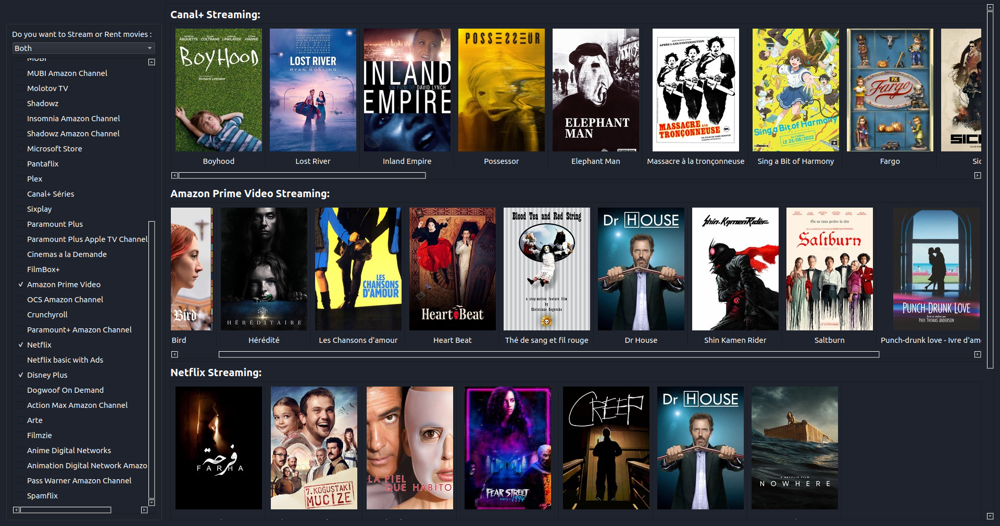

# LetterBoxD to JustWatch Filter

  

LetterBoxD to JutWatch Filter is a tool that allows you to determine which movies from a LetterBoxD list is available to stream or rent based on the services you're suscribed to (or the ones you're willing to pay for).

Available as both a minimal cli and a gui version

Right now it searches the movies using the french JustWatch version, but an international version is on the way too.

Feel free to make any contribution / raise issues

